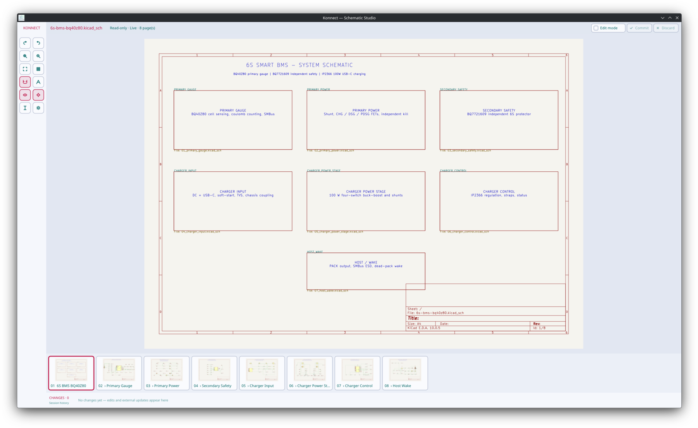
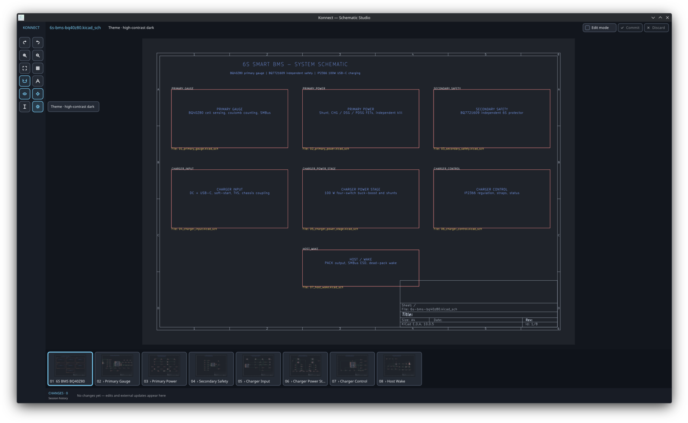
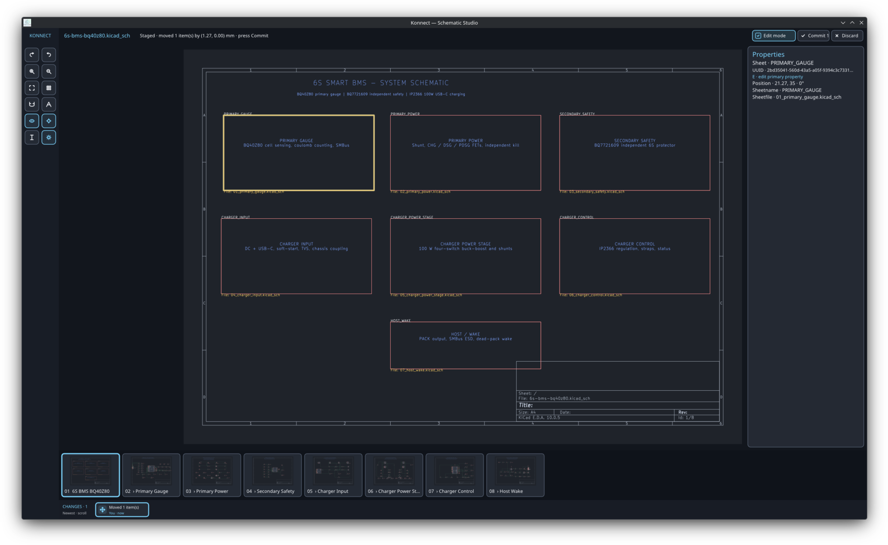

# Schematic viewer and editor

The schematic viewer has two separately built front ends and one shared file
transaction layer. The native Vello build is the real-time editor. The default
compatibility build remains a KiCad-rendered reference viewer.

## Screenshots

### Hierarchy overview and page filmstrip



### High-contrast dark theme



### Staged edit, properties, and change timeline



## Renderer modes

| Feature | Purpose | Runtime dependencies |
|---|---|---|
| `renderer-vello` | Real-time native rendering and editing | A wgpu-supported graphics backend |
| `renderer-kicad-cli` | KiCad SVG fidelity reference | KiCad and the platform WebView |

The native build does not link WebKitGTK, WebView2, or WKWebView. It parses
`.kicad_sch` files directly and renders their semantic geometry through Vello.
When a sheet contains an unsupported visual construct, only that sheet switches
to a KiCad SVG fallback. The export runs in the background against an isolated
temporary copy of the complete hierarchy, is rendered by Vello, and is cached
outside the project. Supported sheets continue to use direct rendering.

```bash
cd crates/schematic-viewer
cargo build --release --no-default-features --features renderer-vello
```

## Interaction

| Input | Action |
|---|---|
| `Edit mode` checkbox | Enable or disable schematic mutation; it starts disabled |
| `Commit` or Ctrl/Command + Enter | Atomically write every staged file after exact conflict checks |
| `Discard` | Drop every staged edit and reload the durable source |
| Left click | Select an item |
| Shift/Ctrl/Command + click | Add or remove an item from the selection |
| Left drag on empty space | Box select; left-to-right contains, right-to-left crosses |
| Left drag on selected items | Preview a snapped move and stage it once on release |
| Alt + left drag, middle drag, or right drag | Pan |
| Mouse wheel | Zoom at the pointer |
| `0` | Fit the active page |
| Left/Right | Previous or next hierarchy page |
| `G` | Cycle the grid |
| `S` | Toggle grid snapping |
| Ctrl/Command + arrow | Nudge selected items by one grid step |
| `R` | Rotate selected symbols or bus entries 90 degrees |
| `X` / `Y` | Mirror selected symbols on the chosen axis |
| Ctrl/Command + `D` | Duplicate one symbol with a fresh UUID and unannotated reference |
| Delete | Delete the selected items as one command |
| `E` | Edit the primary property of one selected item |
| Ctrl/Command + `F` | Search references, values, nets, UUIDs, sheets, and files |
| `W` | Start a snapped wire; click its endpoint to stage |
| Shift + `W` | Start a snapped bus segment; click its endpoint to stage |
| `J` | Place a junction at the pointer |
| `Q` | Place a no-connect marker at the pointer |
| `L` | Place a named local label at the pointer |
| `B` | Place a bus entry at the pointer |
| Shift + `B` | Cycle the bus-entry direction |
| `H` | Create or link a hierarchical sheet using the modal |
| `P` | Add a typed pin to the nearest edge of one selected hierarchical sheet |
| Ctrl/Command + `Z` | Undo |
| Ctrl/Command + Shift + `Z`, or Ctrl/Command + `Y` | Redo |
| Text-selection icon, then drag | Select a character range in UI text or a complete schematic text primitive |
| Ctrl/Command + `C` | Copy the active text selection to the platform clipboard |
| Escape | Cancel the active draft or modal; otherwise clear selection |

The 96-pixel left rail replaces the old button-heavy top toolbar. Its native
vector icons are arranged in a compact two-column grid; hover reveals a full
action name, current state, and shortcut. Active modes use both an accent fill
and border, so state never depends on icon color alone. It contains undo, redo,
zoom, fit, grid, snap, theme, text selection, and three persistent preferences:

- `UI n%` cycles interface text through 100%, 115%, 125%, 140%, and 160%.
  Schematic text remains at exact KiCad geometry; zoom controls its apparent
  size without corrupting file or render parity.
- `Changes [x]` highlights the exact artwork of items referenced by the active
  timeline event. It uses symbol and wire contours, not rectangular bounds.
- `Follow [x]` switches to the affected sheet and zooms to the newest external
  change from Konnect, KiCad, or another writer.
- `Theme` switches between KiCad light and high-contrast dark and remembers the
  choice across viewer restarts.
- The I-beam icon enters text-selection mode. UI text supports exact character
  ranges; every rendered schematic text primitive can be selected as a whole.
  Ctrl/Command + C copies through the native Windows, macOS, X11, or Wayland
  clipboard. Escape returns to editing without changing the schematic.

These settings are saved atomically in the platform user-configuration folder.
The compact top strip also contains the session-only `Edit mode` checkbox and
the `Commit` and `Discard` controls. Commit displays the number of dirty files;
the controls consume no additional canvas height.

Edit mode is deliberately off at startup. Every mutation, including undo and
redo, updates only the in-memory semantic scene and timeline. The original
`.kicad_sch` files remain byte-identical until `Commit` is pressed. `Discard`
restores the durable source without writing anything. Edit mode cannot be
disabled while changes are pending, preventing an ambiguous half-finished
session.

Dark theme uses a dedicated high-contrast palette rather than reusing KiCad's
light-canvas colors on gray. Primary UI text has at least 7:1 contrast against
every dark UI surface, schematic roles have at least 4.5:1 contrast against the
page, and cards retain at least 3:1 boundary contrast. Bus, wire, symbol, pin,
label, warning, and selection colors remain visually distinct.

The bottom filmstrip shows every discovered hierarchy page in a compact
130-pixel region. A 50-pixel Fusion-style change timeline runs directly below
it. Local edits, undo/redo, and external file changes enter as animated cards.
The complete log remains available for the lifetime of the Schematic Studio
process, and the rail scrolls back through older entries without discarding
them. Every event is classified and receives a dedicated add, delete, duplicate,
edit, external, move, transform, undo, redo, or wire icon. Origin color remains
secondary metadata. Clicking a card navigates to its sheet and changed items.
Switching pages does not reparse or rerender unchanged sheets. Design-check text
uses the configured UI scale, shows a compact readable subset, and each visible
warning can be clicked to zoom to its schematic coordinate. The design-check
panel is non-modal: its collapsed state is a compact pill initially docked at
the upper right of the canvas. Drag the six-dot handle in either collapsed or
expanded form; each form remembers its own position. The plus/minus button
switches forms, and the controls remain usable in text-selection mode.

## Native architecture

The native editor is split along mutation and frame-time boundaries:

- `native_scene` owns KiCad semantic parsing, render primitives, hit-test
  objects, hierarchy discovery, connectivity diagnostics, and source-local
  geometry transforms;
- `vello_render` converts immutable semantic primitives into Vello scenes and
  contains the KiCad-compatible geometric quantization used by golden tests;
- `editor_model` contains input-independent snapping, selection, revision, and
  external-change logic;
- `editor_history` prepares grouped forward/inverse commands and revisions;
- `edit_session` owns in-memory before/staged images, dirty-file accounting,
  external-conflict state, and the explicit commit plan;
- `change_timeline` owns the process-lifetime, animated local/external event
  model and deterministic icon classification;
- `viewer_settings` loads and atomically saves cross-platform UI, theme,
  highlight, and follow preferences;
- `konnect-sexp::command` owns typed item-level mutations and conflict-aware
  rebasing, while `konnect-sexp::transaction` owns durable multi-file commit and
  recovery;
- `vello_app` is the window, event, modal, background-worker, and composition
  layer. It does not serialize schematic mutations directly.

This keeps parsing and mutation testable without a GPU or window, and keeps the
frame encoder independent of editor state.

## Transaction and conflict model

All viewer edits and the migrated Konnect schematic tools use
`konnect_sexp::SchematicCommand`. The viewer evaluates those commands with
`prepare_command` against its staged source; only its explicit Commit action
calls the durable transaction layer.

1. A command records stable KiCad item UUIDs, exact expected item blocks, and
   their replacements, insertions, or deletions.
2. The command is applied to an in-memory source image. Rendering, diagnostics,
   undo, redo, and connected-wire behavior immediately use that staged image;
   the durable file is not opened for writing.
3. Commit builds one project transaction containing the exact original and
   staged image for every dirty file. New hierarchical child sheets are create-
   only transitions in the same transaction.
4. Commit acquires all cooperative locks in stable path order and verifies every
   original image. A KiCad lock, external change, changed target, or newly
   occupied creation path stops the complete commit without writing any file.
5. Only after every precondition passes does the journaled transaction replace
   or create the files atomically. The session remains staged after a failed
   commit so the user can inspect or discard it.
6. Undo and redo operate inside the staged session. After a successful commit,
   both stacks are cleared so they cannot cross a durable transaction boundary.

Commands whose validation depends on a document-wide invariant can opt into a
strict base revision. Hierarchical-sheet insertion uses this policy because its
name and page number must remain unique; any intervening parent edit is reported
as a conflict and the operation is retried after reload. Ordinary UUID-owned
edits retain disjoint rebasing.

Hierarchy operations spanning a parent and child use a project-local
write-ahead journal. Every target has an exact before image and replacement,
and all cooperative locks are acquired in stable path order before validation.
Startup recovery rolls an interrupted operation forward only when each file
still matches one of those recorded images. Divergent external content is never
overwritten: the journal is retained and a transaction conflict is reported.
Populated-child instance-path patches and their parent link share one journal
and one grouped inverse history entry, so undo and redo also span both files.
Konnect's hierarchy lifecycle uses the same primitives: add, duplicate, and
recursive page renumbering are durable multi-file transactions, while sheet
properties, movement, deletion, and sheet-pin mutations are UUID-targeted
commands that safely rebase across unrelated viewer edits.

History holds at most 200 inverse commands. A failed undo or redo stays in its
original stack so it can be retried after the conflict is resolved. Staging is
allowed while KiCad is open because it performs no file write, but Commit is
refused while any dirty sheet has a KiCad lock file.

Movement commands calculate electrical attachments before editing. When one
wire endpoint touches a moved symbol pin, sheet pin, junction, label, or other
point-like electrical item, that endpoint follows while the remote endpoint
stays fixed. If both wire endpoints attach to the moved selection, the whole
wire translates without deformation. Selected items and every affected wire
UUID commit together under the same item preconditions, so a concurrent change
to any participant stops the complete move safely.

During drag preview, moving objects and attached wires are removed from a
one-time masked base scene and drawn only at their proposed geometry. The full
cached sheet is never drawn underneath them, eliminating phantom copies while
keeping masking work out of the frame loop.

## Real-time reload flow

Filesystem notifications contain paths only; they never parse on the UI thread.
A background worker coalesces changes, tags each batch with a generation, parses
only changed or uncached sheets, and abandons obsolete generations. The UI merges
the newest completed scenes while retaining unchanged page scenes, the active
page, and still-valid UUID selections.

Unsupported-sheet KiCad exports and SVG parsing use the same worker. Temporary
snapshots preserve the hierarchy's relative layout and relevant project sidecar
files. No export process reads or locks the live schematic.

## Design diagnostics

The native scene builds a lightweight live connectivity model from wires,
symbol pin endpoints, labels, junctions, and no-connect markers. It currently
reports:

- dangling wire endpoints;
- no-connect markers attached to wires;
- duplicate annotated symbol references;
- duplicate hierarchical-sheet names and duplicate pins within one sheet;
- T-connections that need an explicit junction dot;
- bus entries that do not bridge a bus segment and wire;
- visible hierarchical-sheet fields with no position, which KiCad exports at
  the page origin and therefore stacks on top of one another.

Warnings are marked on the sheet and listed with schematic coordinates. They
refresh after every staged edit, committed transaction, or external file update. These checks are
interactive guidance, not a replacement for KiCad ERC.

External file updates are distinguished from the viewer's own atomic writes by
their exact document revision. A review banner summarizes UUID-owned items added,
removed, and modified on every affected sheet, including a few changed UUIDs.
If an external notification overlaps a staged file, its preview is preserved,
the session is marked conflicted, and Commit is disabled. Discard loads the
external source; the viewer never silently chooses one writer's version.

The same structured UUID summary feeds the timeline, contour highlights, and
optional follow behavior. Removed-only events remain navigable and open their
sheet fitted to page because deleted geometry no longer has bounds.

## Validation

```bash
# Shared command/parser tests
cargo test -p konnect-sexp

# Native renderer/editor
cd crates/schematic-viewer
cargo test --no-default-features --features renderer-vello

# Compatibility viewer
cargo test

# Installed-KiCad pixel comparison
../../scripts/compare-schematic-renderers.sh path/to/sheet.kicad_sch

# Release-mode parse/semantic/scene-encoding latency
../../scripts/benchmark-schematic-viewer.sh path/to/root.kicad_sch 20
```

The renderer comparison scripts support strict same-Vello semantic comparisons
and broader cross-rasterizer image diffs. See the root README for the current
environment variables and golden fixture commands.

### Acceptance evidence (2026-07-26)

| Check | Result |
|---|---|
| Full Konnect workspace tests | Pass, including 179 `konnect-core` tests and protocol/integration suites |
| Shared command/parser tests | Pass: 68 unit tests, 8 property tests, and doc tests |
| Native viewer/editor tests | Pass: 86 tests, including commit-only staging, explicit durable commit, external-write refusal, compact edit controls, icon classification/encoding, Unicode-safe text selection, movable diagnostics persistence, connected-wire conflict, dark-theme contrast, settings persistence, and a 129-page synthetic hierarchy |
| Compatibility viewer tests | Pass: 21 tests |
| Strict Clippy (`-D warnings`) | Pass for shared core/command crates and native viewer |
| Windows native cross-check | `x86_64-pc-windows-gnu` passes |
| macOS native cross-check | `x86_64-apple-darwin` passes |
| Linux Wayland smoke | Real five-page BMS hierarchy stayed live with no renderer/startup error |
| Linux X11/XWayland smoke | Forced X11 run stayed live; direct window capture populated and sharp |
| KiCad parity project check | All four positioned child sheets have same-Vello semantic RMSE 0 against KiCad 10.0.5 SVG. The root sheet reports 0.000383739 solely in a 116 x 8 pixel strip at the page origin, where its existing visible `Sheetname` and `Sheetfile` fields lack positions and KiCad plots them on top of one another. Cross-rasterizer RMSE ranges 0.00309187–0.00714131. |
| Headless full-page render | 2970×2100 BMS primary sheet completed in 2.34 s in a debug build using deterministic CPU Vello |
| Release responsiveness benchmark | Five-page BMS: active-sheet parse/encode p95 0.664 ms; full hierarchy parse/encode p95 317.764 ms over 20 iterations |

The headless timing is a reproducibility baseline, not the interactive latency:
the live window uses GPU Vello and caches already encoded scenes. Release-mode
latency is machine-readable through `KONNECT_BENCH`; CI can enforce
`KONNECT_MAX_ACTIVE_P95_MS` and `KONNECT_MAX_HIERARCHY_P95_MS`. Native CI also
constructs, discovers, parses, and renders the semantic scenes for a synthetic
129-page hierarchy, preventing hierarchy-scale regressions from hiding behind
the small golden fixtures.

## Current boundaries

- Direct editing covers symbols, wires, junctions, labels, no-connects, bus
  entries, text, and sheet objects for movement. Creation covers wires,
  bus segments, junctions, local labels, no-connects, bus entries, and new,
  empty, or populated hierarchical sheets. Typed hierarchical pins can be
  placed on an exact sheet border and participate in atomic undo/redo.
- Linking a populated existing child patches its symbol instance paths in the
  same durable transaction as the parent link. Undoing a newly-created sheet
  link removes the parent reference but deliberately retains the child file as
  a recoverable project asset.
- The native renderer explicitly reports unsupported top-level visual constructs
  and uses per-sheet fallback when KiCad is installed.
- Compatibility fallback is a visual layer. Hit testing, selection, edits, and
  diagnostics continue to use the semantic native scene and stable KiCad UUIDs.
